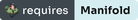
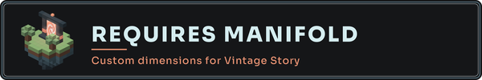
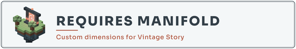

# "Requires Manifold" badge kit

A badge a mod author can put on a Mod DB page, a GitHub README or a forum post to tell players
their mod needs Manifold installed. It links to Manifold's Mod DB page, where the download is.

Five formats, three palettes, each shipped as `.png` at 1x and 2x (`@2x`). Every badge has its
own opaque ground and a thin frame, so it reads on any page background. The mark is the portal
island from the documentation site's hero, drawn by the same voxel renderer as
[`docs/assets/moddb`](../moddb/README.md).

## Gallery

| Format | void | light | slate |
| --- | --- | --- | --- |
| flat, 138x20 |  |  |  |
| plaque, 220x60 |  |  |  |
| square, 160x160 |  |  |  |
| seal, 112x112 |  |  |  |
| wide, 600x100 |  |  |  |

- **void**: the dark ground of Manifold's own Mod DB page and of the docs site. Pick this one
  for a dark page.
- **light**: slate ink on a near-white ground, for a GitHub README on the light theme.
- **slate**: white ink on slate blue, for a page that is neither.

Which format goes where:

- **flat**: a strip for a README badge row, next to the CI and license badges.
- **plaque**: a small framed rectangle, for a section of a Mod DB page.
- **square**: a tile, for a sidebar or a gallery slot.
- **seal**: a round mark, for a page corner or a footer.
- **wide**: a banner with a subtitle, for the top or bottom of a Mod DB description.

## Snippets

Each snippet uses the void file. Swap `-void` for `-light` or `-slate` in the file name to
change palette: same dimensions, same wording. Add `@2x` before `.png` and keep the `width`
for a sharp image on high-density screens.

### flat

GitHub README (Markdown):

```md
[](https://mods.vintagestory.at/manifold)
```

Mod DB page (HTML):

```html
<a href="https://mods.vintagestory.at/manifold"></a>
```

Vintage Story forum (BBCode):

```bbcode
[url=https://mods.vintagestory.at/manifold][img]https://raw.githubusercontent.com/Pixnop/Manifold/main/docs/assets/badges/requires-manifold-flat-void.png[/img][/url]
```

### plaque

GitHub README (Markdown):

```md
[](https://mods.vintagestory.at/manifold)
```

Mod DB page (HTML):

```html
<a href="https://mods.vintagestory.at/manifold"></a>
```

Vintage Story forum (BBCode):

```bbcode
[url=https://mods.vintagestory.at/manifold][img]https://raw.githubusercontent.com/Pixnop/Manifold/main/docs/assets/badges/requires-manifold-plaque-void.png[/img][/url]
```

### square

GitHub README (Markdown):

```md
[](https://mods.vintagestory.at/manifold)
```

Mod DB page (HTML):

```html
<a href="https://mods.vintagestory.at/manifold"></a>
```

Vintage Story forum (BBCode):

```bbcode
[url=https://mods.vintagestory.at/manifold][img]https://raw.githubusercontent.com/Pixnop/Manifold/main/docs/assets/badges/requires-manifold-square-void.png[/img][/url]
```

### seal

GitHub README (Markdown):

```md
[](https://mods.vintagestory.at/manifold)
```

Mod DB page (HTML):

```html
<a href="https://mods.vintagestory.at/manifold"></a>
```

Vintage Story forum (BBCode):

```bbcode
[url=https://mods.vintagestory.at/manifold][img]https://raw.githubusercontent.com/Pixnop/Manifold/main/docs/assets/badges/requires-manifold-seal-void.png[/img][/url]
```

### wide

GitHub README (Markdown):

```md
[](https://mods.vintagestory.at/manifold)
```

Mod DB page (HTML):

```html
<a href="https://mods.vintagestory.at/manifold"></a>
```

Vintage Story forum (BBCode):

```bbcode
[url=https://mods.vintagestory.at/manifold][img]https://raw.githubusercontent.com/Pixnop/Manifold/main/docs/assets/badges/requires-manifold-wide-void.png[/img][/url]
```

## Regenerating

    python3 docs/assets/badges/generate.py /path/to/Sora[wght].ttf

Needs Pillow and NumPy, and the Sora variable font, which is not in this repository
([OFL](https://fonts.google.com/specimen/Sora)). The wording, the palettes and the layout of
each format are constants at the top of `generate.py`.
